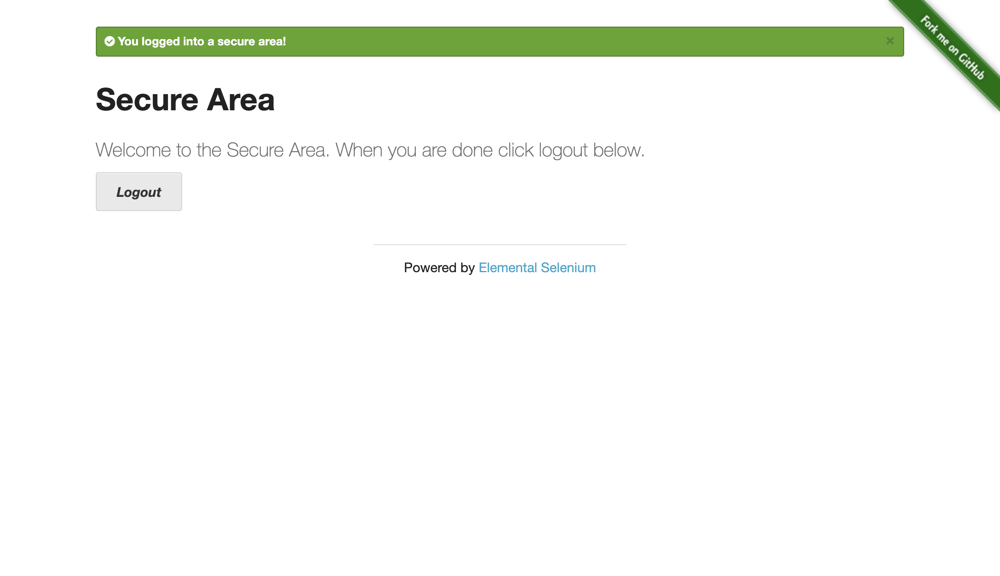
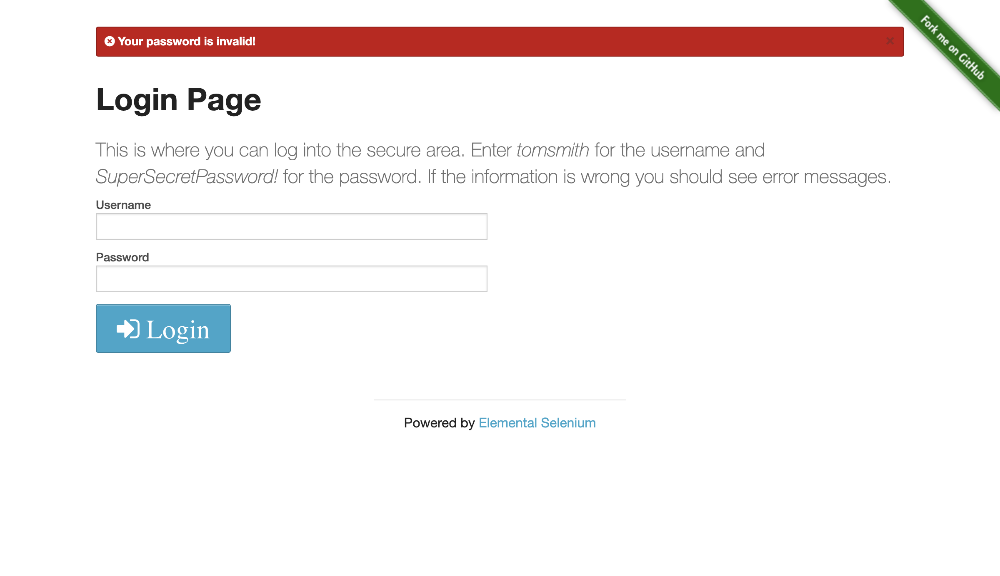
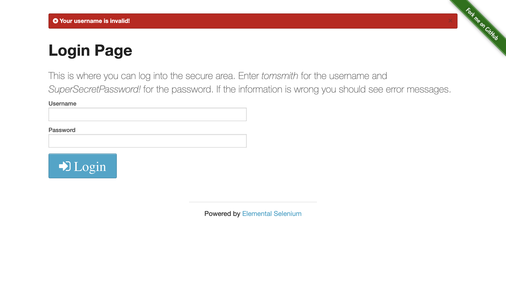
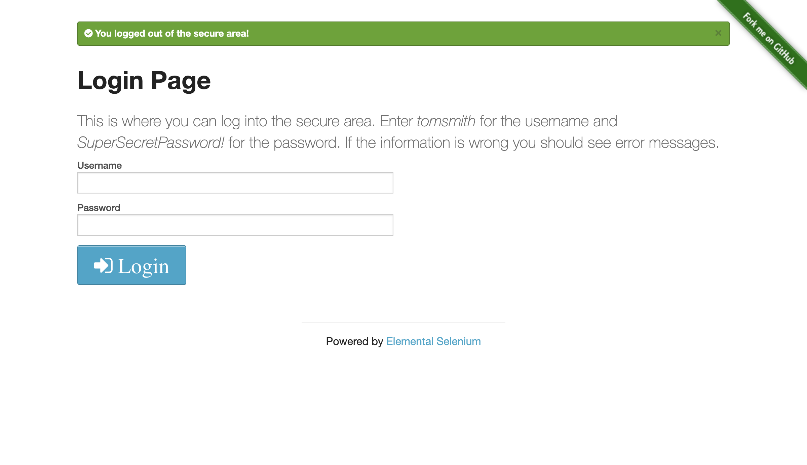

# 🧪 Herokuapp Login UI Automation — Java + Selenium

This repository contains automated UI tests for the login functionality of [the-internet.herokuapp.com](https://the-internet.herokuapp.com/login), implemented in **Java 17** using **Selenium WebDriver** and **JUnit 5**.  
Each test is structured, validated, and followed by a screenshot for visual reporting.

---

## 📌 Description

The test suite covers the following scenarios:

- ✅ Successful login
- ❌ Invalid password
- 🕳 Empty login & password fields
- 🔁 Logout after successful login

Each test captures a screenshot into `/screenshots/` using the test name.

---

## 🛠 Tech Stack

- Java 17  
- Maven  
- Selenium WebDriver  
- JUnit 5  
- ChromeDriver  
- GitHub

---

## ✅ Test Cases

| #  | Test Case                     | Status |
|----|-------------------------------|--------|
| 1  | Successful login              | ✅     |
| 2  | Invalid password              | ✅     |
| 3  | Empty username & password     | ✅     |
| 4  | Logout after successful login | ✅     |

---

## 📂 Project Structure

```
qa-the-internet-java-autotest/
├── pom.xml
├── README.md
├── screenshots/
│   ├── 01_successful_login.png
│   ├── 02_invalid_password.png
│   ├── 03_empty_fields.png
│   └── 04_logout_flow.png
└── src/
    └── test/
        └── java/
            └── com/
                └── theinternet/
                    └── login/
                        └── LoginTest.java
```

🔗 [View test code → `LoginTest.java`](src/test/java/com/theinternet/login/LoginTest.java)

---

## 🖼 Screenshots

### ✅ 01 – Successful Login  


### ❌ 02 – Invalid Password  


### 🕳 03 – Empty Fields  


### 🔁 04 – Logout Flow  


---

## 🚀 Run Locally

1. Install Java 17+, Maven, and Chrome
2. Clone this repository
3. Run tests with:

```bash
mvn test
```

4. Screenshots will be saved automatically to `/screenshots/`
